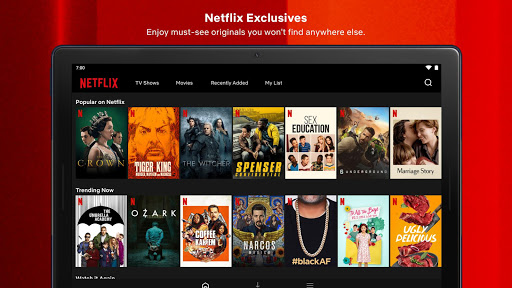

# Menu page

- Application home page
- The police officer chooses which situation he wants to train on
- Maybe a small menu at the top, with a connexion button ?

### UI concept:

  

- Lists all situations present in the application

  - Harassement
  - Child Abuse
  - Family Harassement
  - Rape
  
- Each box is a button, with an image and a title. On click, the policeman arrives on a chat.
- Like the Netflix homepage, but way clearer and simpler

  

